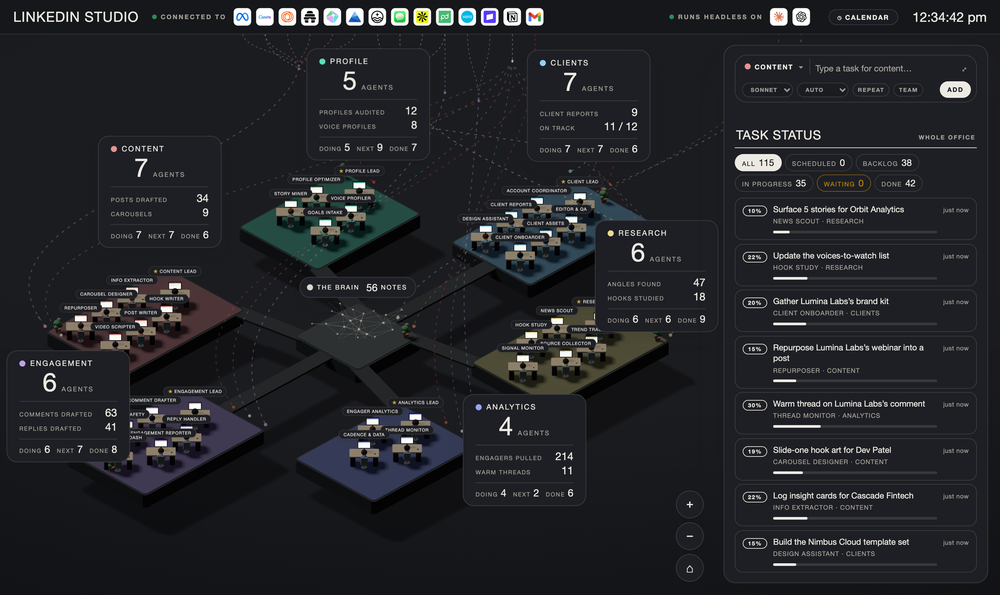
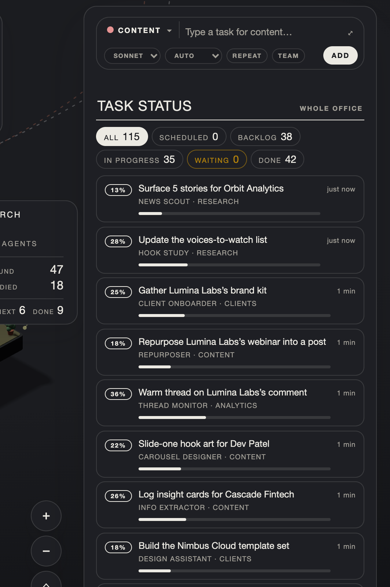
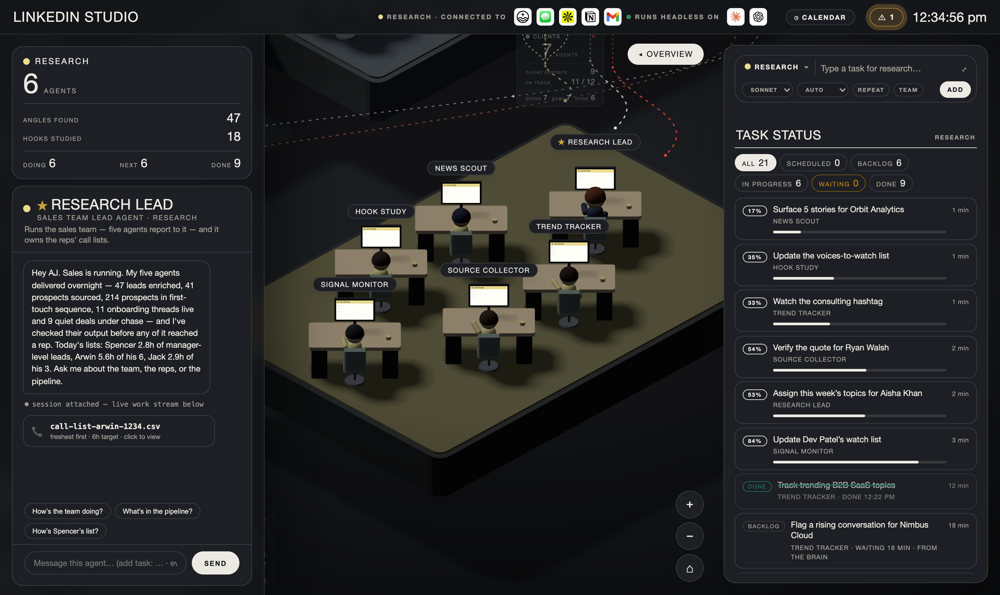

# LinkedIn Studio

A 3D isometric office where a team of AI agents runs LinkedIn personalization for your clients — on your own Claude login.



**Live demo:** https://linkedin-studio-git-main-vignesh-gs-projects.vercel.app
_(the deployed build runs the office UI in demo mode — real agent tasks run locally; see [Install](#install))_

Six departments, thirty-five agents at their desks, a task bar that routes what you type to the right agent, and a Brain at the centre that is your own folder of notes. A client shares their LinkedIn profile; the office audits it, learns their voice, researches their domain, writes and repurposes posts, drafts comments and replies, tracks what works, and files every deliverable back into your notes. Nothing goes out without your OK. Everything runs on your machine.

Built on the [linkedin-skills](https://github.com/sergebulaev/linkedin-skills) toolkit, adapted to the office's read-freely / approve-before-publish model.

## The pipeline

A client's work moves through six pods, left to right:

| Pod | What it does | Skills |
|-----|--------------|--------|
| **PROFILE** | Onboards a client from their LinkedIn profile — full audit, story interview, voice profile | profile-optimizer · interviewer · humanizer (voice) |
| **RESEARCH** | Scans the client's domain for news, trends, sources, and reverse-engineers viral hooks | hook-extractor + news/trend/source/signal scouts |
| **CONTENT** | Plans the week, extracts insights, writes hooks and posts, repurposes, humanizes | content-planner · post-writer · repurposer · humanizer |
| **ENGAGEMENT** | Drafts comments on others' posts and replies on the client's, with brand-safety checks | comment-drafter · reply-handler |
| **ANALYTICS** | Pulls engagers by ICP, tracks reply threads, sets cadence from the data | engager-analytics · thread-monitor |
| **CLIENTS** | Delivers, QAs (humanizer audit), reports, and scales via team advocacy | employee-advocacy · humanizer (audit) |

## The 35 agents

- **PROFILE (5):** Profile Lead · Profile Optimizer · Voice Profiler · Story Miner · Goals Intake
- **RESEARCH (6):** Research Lead · News Scout · Trend Tracker · Hook Study · Source Collector · Signal Monitor
- **CONTENT (7):** Content Lead · Info Extractor · Hook Writer · Carousel Designer · Post Writer · Repurposer · Video Scripter
- **ENGAGEMENT (6):** Engagement Lead · Comment Drafter · Reply Handler · Brand Safety · Engagement Reporter · Engagement Dash
- **ANALYTICS (4):** Analytics Lead · Engager Analytics · Thread Monitor · Cadence & Data
- **CLIENTS (7):** Client Lead · Account Coordinator · Editor & QA · Client Reports · Client Assets · Design Assistant · Client Onboarder

## What you need

- macOS or Linux (Windows: works with `npm` commands directly)
- Node.js 20+ — https://nodejs.org
- git
- **Claude Code**, logged in with your Claude account, or an `ANTHROPIC_API_KEY` (required only to run real agent tasks; the office and demo run without it)

## Install

```bash
git clone https://github.com/vigneshganapathi01/linkedin-studio.git
cd linkedin-studio
npm install
node build.mjs
npm start        # → http://localhost:4520
```

Then open http://localhost:4520. The panel says **LIVE · CLAUDE** when the server is connected. The UI opens in **dark theme** by default (press **D** to toggle light, or add `?dark=0` to the URL).

Double-clicking `dist/command-centre-v2.html` opens the same office standalone, in demo mode, with no server.

## First five minutes

1. Open the office. Pick a department, type a task in plain words, press **Add**. Claude picks the agent; the task appears in the feed; the agent reads your notes, does the work, and the deliverable lands in that agent's chat and in your Brain folder.
2. Onboard a client: share their LinkedIn profile URL with the **Profile Lead** and say "set up this client". The PROFILE pod audits the profile, interviews for stories, and builds a voice profile — the brief the whole office works from.
3. Click any agent to talk to them. Say `revise: make it punchier` and they rework their last deliverable.
4. Press **G**, or click the Brain, to open your notes as a graph.
5. The top bar shows the connectors your Claude Code is connected to; when an agent uses one, it lights up.

## The skills

The 12 LinkedIn skills live in `brain/Agents Office/skills/`, each bound to the agents that use it (adapted to the office's under-6,000-character skill format). The full original skills and their references (hook formulas, voice rules, algorithm heuristics, benchmarks, story bank) are kept as Brain notes under `LinkedIn Skills Reference/`, which agents read on demand.

Every outbound action — a post, comment, reply, or DM — is prepared as a **draft** and waits for your approval. Reading a LinkedIn post works from the URL or text you provide, or your own Chrome; the office does not post to LinkedIn directly.

## Make it yours

- **Agents** live in `office.agents.json` (defaults) and `office.agents.local.json` (your copy). Change a name, role, what an agent does, its tools, or its standing `brief`. Six departments and 35 seats are fixed.
- **Skills** teach an agent how a kind of work is done: a folder with a `SKILL.md` in `brain/Agents Office/skills/<name>/`, bound to an agent or department in its front matter.
- **Connectors** the agents may use are set in `office.config.json` (`mcp.allow` / `deny` / `departments`, plus `tools.web` and `tools.browser`).
- Run `npm run check` after any change; it validates the roster, skills, and routines.

## Routines

Tasks on the office's own clock — "every weekday at 8am, scan the client's domain". This release supports routines for the **Profile, Analytics and Research** pods. Type one with a time in it, or press **REPEAT** / the calendar (**P**).

## Screenshots

The task feed — LinkedIn work routed to the right agent, per client:



A department in focus (Content pod):



## Credits

Forked from Agents Office by Sahni.ai. LinkedIn skill set adapted from [sergebulaev/linkedin-skills](https://github.com/sergebulaev/linkedin-skills) (MIT). See [LICENSE](LICENSE).
